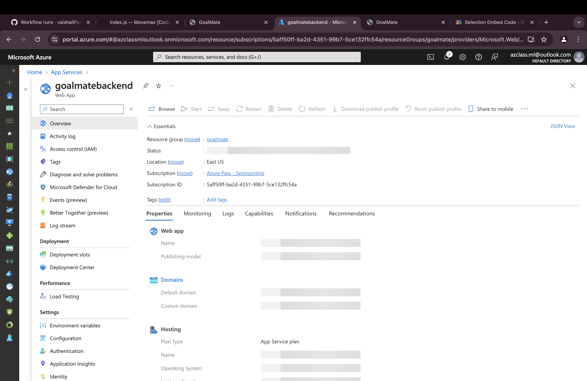
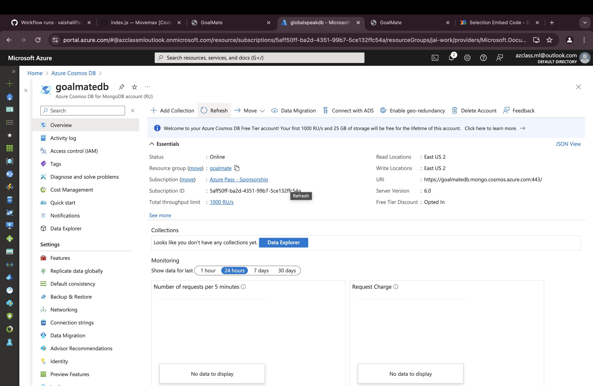
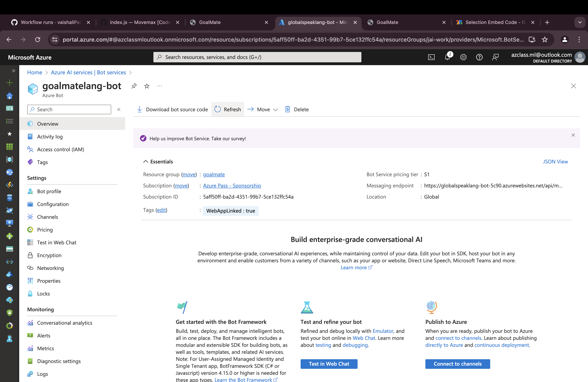
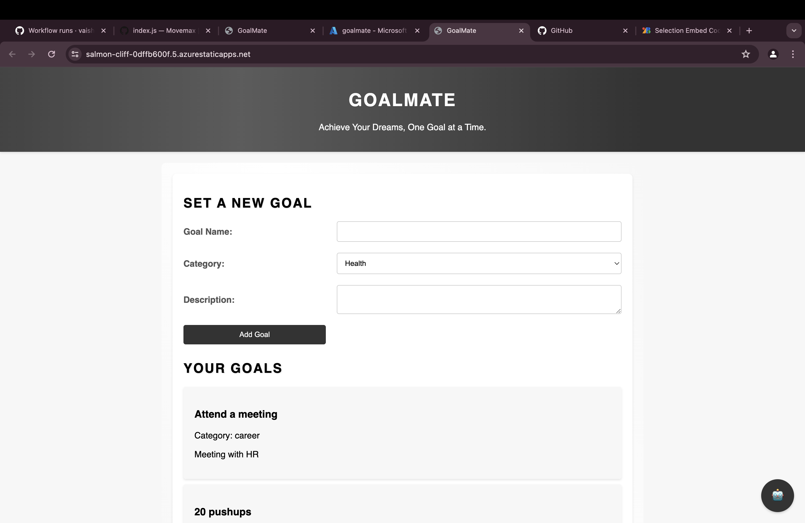
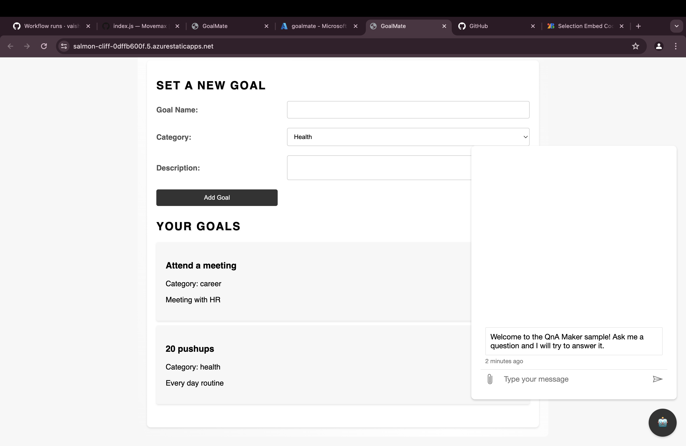

<h1>Goalmate/h1>
<h2>Project Title: Goalmate</h2>
<b><a href="https://salmon-cliff-0dffb600f.5.azurestaticapps.net/">goalmate</a></b>
 
<h2>Project Details</h2>
<b>Project Demo URL :</b> https://salmon-cliff-0dffb600f.5.azurestaticapps.net/  
<b>Github Repository URL :</b> https://github.com/vaishaliPazare7/goalmate 
<b>Google Drive URL :https://1drv.ms/v/s!AuAvbZd68ZoVhFB7Zawea2es1q55?e=E17qeJ</b>  
<b>Industry :</b> Lifestyle 

<h2>Problem Statement</h2>

To develop a comprehensive goal-setting and productivity app that empowers users to define, track, and achieve their daily goals across various life domains, including career, relationships, health, and personal growth. The app will provide a user-friendly interface for users to create customizable goal categories, set specific and measurable targets, and receive personalized reminders and progress tracking.

<h2>Key Features</h2>
<ul>

Goal Setting:

Allow users to create customizable goal categories tailored to their unique needs (e.g., career, relationships, fitness, education, personal development).
Enable users to set specific, measurable, achievable, relevant, and time-bound (SMART) goals for each category.
Provide templates and examples to guide users in setting well-defined goals.

Daily Planning and Scheduling:

Offer a daily planner feature where users can schedule tasks and activities aligned with their goals.
Integrate a calendar view for easy visualization and management of daily schedules and deadlines.

Progress Tracking and Reminders:

Allow users to log their progress and accomplishments towards their goals.
Implement a gamification system with rewards and achievements to foster motivation and engagement.
Send timely reminders and notifications to keep users on track with their goals and schedules.

Analytics and Insights:

Provide data visualization and analytics tools to help users track their progress over time.
Offer insights and suggestions based on user behavior and goal achievement patterns.

Social and Accountability Features:

Incorporate a social component that allows users to connect with friends, family, or a community for support and accountability.
Enable users to share their goals and progress with their connections, fostering encouragement and motivation.

Personalization and Customization:

Allow users to personalize the app's appearance, settings, and preferences according to their needs and preferences.
Offer integration with other productivity tools, calendars, and wearable devices for seamless data synchronization.
</ul>

<h2>Application Architecture</h2>

User Interface: This component encompasses the various UI elements and views for setting goals, planning tasks, tracking progress, analyzing data, engaging with the social community, and managing personal settings.
The client application can be developed as a native app for iOS and Android platforms or using cross-platform frameworks like React Native or Flutter.
API Gateway: Acts as a single entry point for client requests, routing them to appropriate backend services.
Authentication and Authorization: Handles user authentication and authorization using industry-standard protocols like OAuth

<h2>Technology Stack</h2>
<ul>
    <li><b>Frontend:</b> HTML, CSS, JavaScript</li>
    <li><b>Backend:</b> Node.js , Express.js</li>
    <li><b>Database:</b> Azure Cosmos DB</li>
</ul>

<h2>Screenshots</h2>
<h3>Static Web App</h3>
<b>Description:</b>
Using Static Web App for hosting frontend of the Application

</img> 

<h3>App Service</h3>
<b>Description:</b>
Using App service for hosting backend of the application

</img> 

<h3>Azure Cosmos DB</h3>
<b>Description:</b>
Using App service for hosting backend of the application

</img> 

<h3>Azure AI Translator</h3>
<b>Description:</b>
Using Azure AI Translator Service as for translating the text.

</img>

<h3>Live Demo </h3>
<b>Description:</b>
Live project hosted using azure cloud services .

</img>
</img>

<h2>Future Enhancements</h2>

Future enhancements for GoalMate include the integration of advanced analytics and AI for predictive goal achievement and personalized recommendations, along with voice command capabilities. Enhanced social features will allow users to share goals on social media and collaborate on group goals. Gamification elements such as achievement badges, challenges, and streak tracking will motivate users to stay on track. Additionally, syncing with wearable devices like Fitbit and Apple Watch will enable real-time tracking of health-related goals, making GoalMate more intuitive, engaging, and effective for personal and professional development.

<h2>Final Project Statement</h2>

The GoalMate project aims to revolutionize personal and professional development by providing a comprehensive goal-setting and tracking platform. By integrating advanced analytics, AI, and voice commands, GoalMate will offer predictive insights and personalized recommendations. Enhanced social features will foster community support through goal sharing and collaboration, while gamification elements such as badges and challenges will motivate users. Additionally, integration with wearable devices will enable real-time health goal tracking. These features will make GoalMate an intuitive, engaging, and powerful tool for achieving aspirations.

